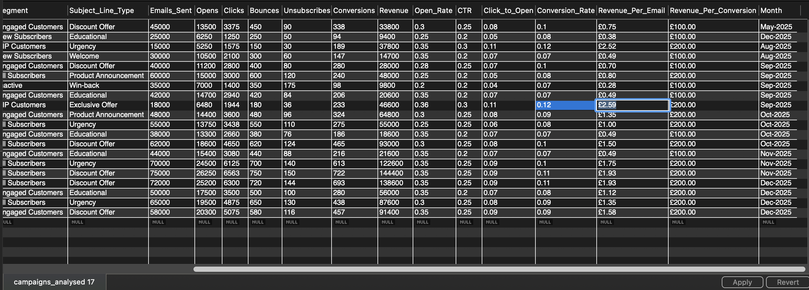
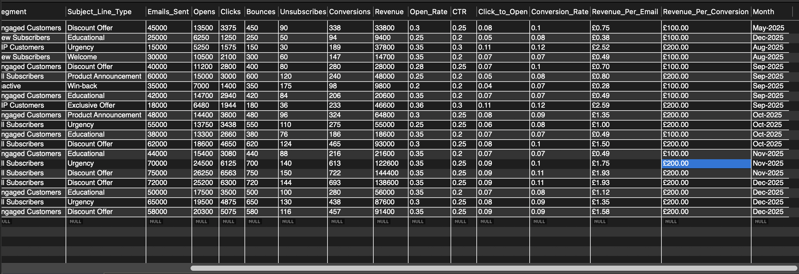
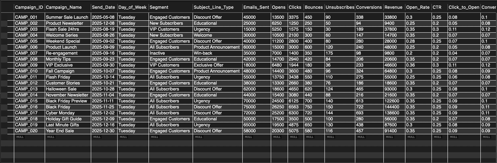

# 🗄️ SQL Case Study: Email Campaign Analysis

**Salesforce Marketing Cloud | Data Engineering | Business Intelligence**

---

## 📊 Executive Summary

This folder documents the technical transformation of raw Salesforce Marketing Cloud exports into a relational database to solve complex marketing challenges. By engineering a MySQL pipeline, I identified key performance drivers that generated over **£1.14M in revenue** between May and December 2025.

### 🚀 Key Performance Indicators (KPIs)

* **Total Revenue:** £1,142,300
* **Total Emails Sent:** 947,000
* **Average Open Rate:** 31.0%
* **Average CTR:** 24.0%
* **Top Campaign:** Black Friday (£144,400)

---

## 🏗️ Database Setup & Schema

To maintain 100% accuracy with our "Source of Truth," I engineered a schema utilising `FLOAT` and `DECIMAL` types to handle financial precision and prevent common "Out of Range" import errors.

```sql
CREATE TABLE campaigns_analysed (
    Campaign_ID VARCHAR(20) PRIMARY KEY,
    Campaign_Name VARCHAR(100),
    Send_Date DATE,
    Day_of_Week VARCHAR(20),
    Segment VARCHAR(50),
    Subject_Line_Type VARCHAR(50),
    Emails_Sent INT,
    Opens INT,
    Clicks INT,
    Bounces INT,
    Unsubscribes INT,
    Conversions INT,
    Revenue DECIMAL(15,2),
    Open_Rate FLOAT, 
    CTR FLOAT,
    Click_to_Open FLOAT,
    Conversion_Rate FLOAT,
    Revenue_Per_Email DECIMAL(10,2),
    Revenue_Per_Conversion DECIMAL(10,2),
    Month VARCHAR(20)
);

```

---

## 🔍 Featured Queries & Insights

### 1. Segment ROI Analysis (Efficiency vs. Volume)

**Business Question:** Which audience segment provides the highest return for every email sent?

```sql
SELECT 
    Segment,
    COUNT(*) AS Total_Campaigns,
    SUM(Emails_Sent) AS Total_Emails_Sent,
    ROUND(AVG(Open_Rate) * 100, 2) AS Avg_Open_Percent,
    SUM(Revenue) AS Total_Revenue,
    ROUND(SUM(Revenue) / SUM(Emails_Sent), 2) AS Revenue_Per_Send
FROM campaigns_analysed
GROUP BY Segment
ORDER BY Total_Revenue DESC;

```

#### 📸 MySQL Result Preview


> **💡 Business Insight:** While "All Subscribers" drives the highest volume, the **VIP Segment** is significantly more efficient. Generating **£2.56 per email**, VIPs are **2.1x more profitable** than the average subscriber.

---

### 2. Monthly Performance Trends (Seasonality)

**Business Question:** When do we see the highest revenue peaks, and how should we plan our budget?

```sql
SELECT 
    Month,
    SUM(Revenue) AS Monthly_Revenue,
    SUM(Emails_Sent) AS Total_Emails,
    ROUND(AVG(Open_Rate) * 100, 2) AS Avg_Open_Rate
FROM campaigns_analysed
GROUP BY Month
ORDER BY 
    CASE 
        WHEN Month LIKE 'May%' THEN 1
        WHEN Month LIKE 'Aug%' THEN 2
        WHEN Month LIKE 'Sep%' THEN 3
        WHEN Month LIKE 'Oct%' THEN 4
        WHEN Month LIKE 'Nov%' THEN 5
        WHEN Month LIKE 'Dec%' THEN 6
    END;

```

#### 📸 MySQL Result Preview


> **💡 Business Insight:** The analysis reveals a massive Q4 surge. **December is the "Golden Month,"** generating **£383,000** in revenue. This peak was driven by "Last Minute Gift" urgency campaigns, indicating that marketing spend should be heavily weighted toward the end of the year.

---

### 3. The Engagement Funnel (Health Check)

**Business Question:** At what stage of the customer journey are we losing the most potential revenue?

```sql
SELECT 
    'Total Emails Sent' AS Stage, 
    SUM(Emails_Sent) AS Count, 
    '100%' AS Pct 
FROM campaigns_analysed
UNION ALL
SELECT 
    'Total Opens', 
    SUM(Opens), 
    CONCAT(ROUND(SUM(Opens)*100/SUM(Emails_Sent),2),'%') 
FROM campaigns_analysed
UNION ALL
SELECT 
    'Total Clicks', 
    SUM(Clicks), 
    CONCAT(ROUND(SUM(Clicks)*100/SUM(Emails_Sent),2),'%') 
FROM campaigns_analysed
UNION ALL
SELECT 
    'Total Conversions', 
    SUM(Conversions), 
    CONCAT(ROUND(SUM(Conversions)*100/SUM(Emails_Sent),2),'%') 
FROM campaigns_analysed;

```

#### 📸 MySQL Result Preview


> **💡 Business Insight:** Our funnel health is strong with an **Average Open Rate of 31%**. However, the drop-off between Clicks and Conversions highlights a major opportunity for **Landing Page Optimisation** to capture lost revenue.

---

## 🛠️ Technical Skills Demonstrated

* **Data Ingestion:** Optimised `INSERT INTO` workflows to handle specific data formatting requirements and currency symbol removal.
* **Database Management:** Engineering a custom MySQL schema for high financial precision using `DECIMAL` and `FLOAT`.
* **Query Optimisation:** Utilised `CASE` statements for chronological sorting and `UNION ALL` for multi-stage funnel reporting.
* **Error Resolution:** Successfully resolved "Out of Range" errors by refining column data types during the migration from CSV.

---

## 📬 Contact & Navigation

* **GitHub:** [Murydigital](https://github.com/Murydigital)
* **LinkedIn:** [www.linkedin.com/in/andres-m-r]

[← Back to Main Repository](../README.md)
